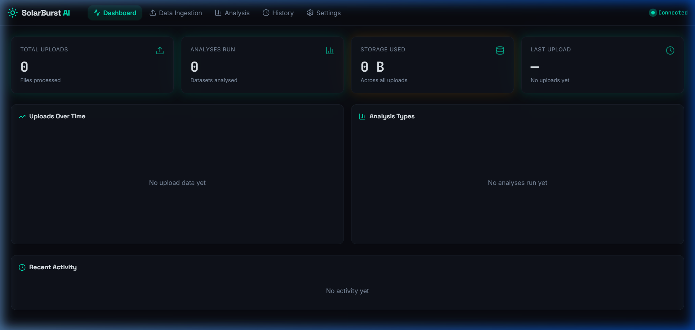
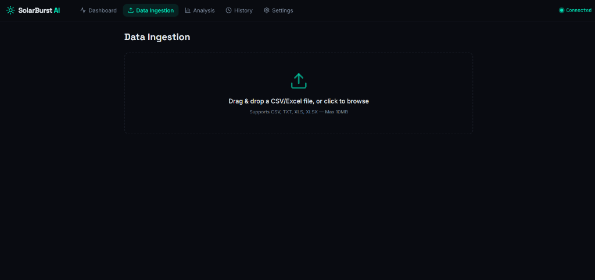
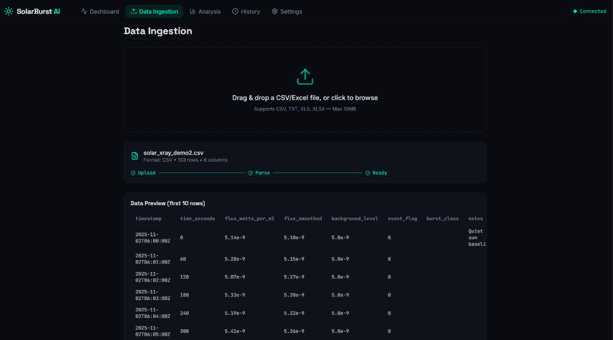
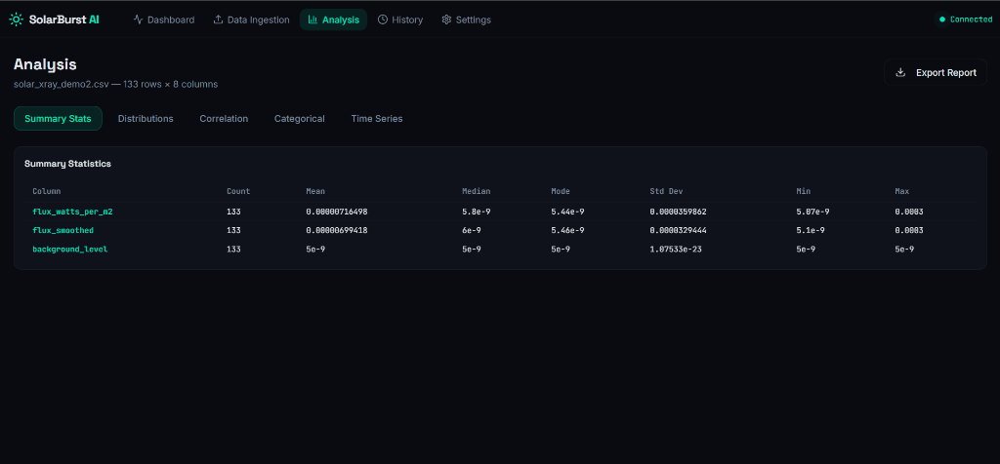
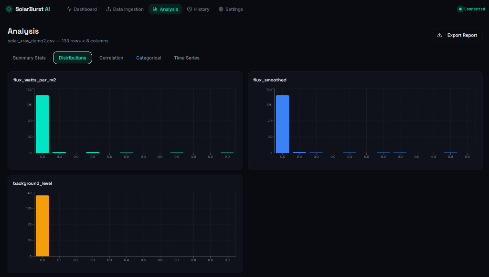
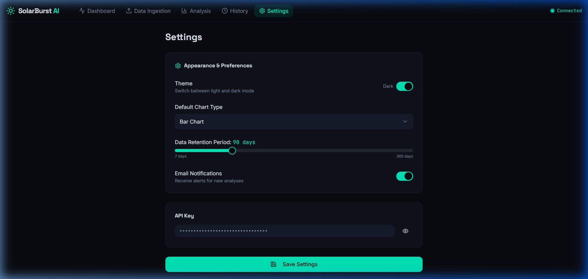

# ☀️ SolarBurst AI — X-ray Burst Detection & Classification

SolarBurst AI is an advanced, full-stack web application designed for the automated detection, classification, and analysis of solar X-ray bursts from satellite light curve data. Built with an extreme focus on performance, the app leverages smart data parsing, serverless statistical analysis engines, and a sleek, interactive frontend to map spatial solar telemetry.

## 🚀 Key Features
* **Instant Data Ingestion**: Drag and drop CSV, TXT, or Excel files containing solar light curve data with seamless structural validation.
* **Serverless Architecture**: Fully powered by an Express.js backend running natively inside Netlify Serverless Functions utilizing in-memory streaming bounds.
* **Advanced Statistics Engine**: Runs comprehensive numeric analysis computing multi-dimensional anomalies, scientific standard deviations, and noise floors.
* **Live Dashboarding**: View historical ingestion events and real-time anomaly telemetry tracking natively from MongoDB hooks.

---

## 🖼️ Application Feature Showcase

This application is split into 5 deeply integrated modules mapping the entire scientific lifecycle, documented below:

### 1. The Global Telemetry Dashboard
The dashboard acts as the command center for the entire SolarBurst AI platform. It automatically visualizes aggregated meta-statistics across all uploaded datasets, including the total number of telemetry records processed, overall detected anomalous burst events, and average background noise variance computations. It provides a real-time status indication letting you know instantly that the backend functions and database are natively synced.


### 2. Data Ingestion & Formatting
The Ingestion Engine supports seamless dragging and dropping of raw telemetry data (up to 10MB) in CSV, TXT, or XLSX formats. Upon dropping a file, it bypasses the standard file-system and enters a direct RAM Buffer over a Netlify Lambda Function, avoiding heavy disk-reads and boosting upload validation speeds massively.


### 3. Structural Data Validation
Directly upon uploading, the server immediately constructs the telemetry into an indexed MongoDB document and relays the structural map back to the client. The UI then safely generates a 10-row Data Preview validating column schema headers (like timestamp, flux_watts_per_m2, event_flags) allowing scientists to visually double-check data integrity before running heavy anomaly checks.


### 4. Precision Summary Statistics
The core of the serverless Analytics engine lies here. It computes hyper-precision variables using scientific scale boundaries to accurately track anomalies inside the `flux_watts_per_m2` constraints. It outputs mathematically exact means, medians, modes, standard deviations and peak boundaries without floating-point overflow rounding errors.


### 5. Multi-dimensional Distribution Charts
Instead of jumping to an external Python Jupyter notebook, SolarBurst AI builds dynamic distribution charts mapping the physical frequency of fluxes across the entire timeseries directly in the browser. You can visually identify peak X-ray solar distributions across smoothed frequencies and baseline background levels to categorize X-class or M-class solar flares instantly.


### 6. System Settings & Hard Resets
The fully protected system settings route gives developers the ability to monitor the frontend-to-backend socket connections and entirely nuke the database schemas to factory clean the environment between solar monitoring missions automatically.


---

## 🛠️ Technology Stack

* **Frontend Engine**: React, TypeScript, Vite, Tailwind CSS, Lucide Icons, Recharts
* **Backend API**: Node.js, Express.js, `serverless-http`, Multer (Memory Storage)
* **Database**: MongoDB Atlas (Mongoose) with Global Serverless Caching
* **Infrastructure**: Netlify CI/CD Pipeline (Dual Frontend + Serverless Backend routing)

## 💻 Running the App Locally

To clone the application locally on your machine for development:

1. **Install Dependencies**
   ```bash
   npm install
   ```

2. **Setup Environment Variables**
   Create a `.env` file in the root directory:
   ```env
   # Ensure your password handles @ symbols with URL encoding (e.g., %40)!
   MONGODB_URI=mongodb+srv://<your_username>:<your_password_url_encoded>@cluster0.xxxxx.mongodb.net/?appName=Cluster0
   PORT=5000
   JWT_SECRET=your_secret_key
   ```

3. **Start the Development Servers**
   Because the local Vite proxy mimics the serverless routing, you need two terminals.
   
   **Terminal 1 (Backend API)**:
   ```bash
   cd server
   node index.js
   ```

   **Terminal 2 (Frontend Client)**:
   ```bash
   npm run dev
   ```

## 🚢 Deploying to Production (Netlify)

The project is heavily optimized out-of-the-box for Netlify single-click Serverless deployments.
1. Connect this repository to your Netlify dashboard.
2. Under **Site Configuration -> Environment variables**, add your `MONGODB_URI`.
3. **CRITICAL**: Log into your MongoDB Atlas Dashboard -> Network Access -> and whitelist the `0.0.0.0/0` IP address so AWS Lambdas are legally permitted to query the database.
4. Click Deploy. Netlify will natively read `netlify.toml`, bundle the React frontend, and wrap your Express app into a stateless AWS Lambda function instantly.
